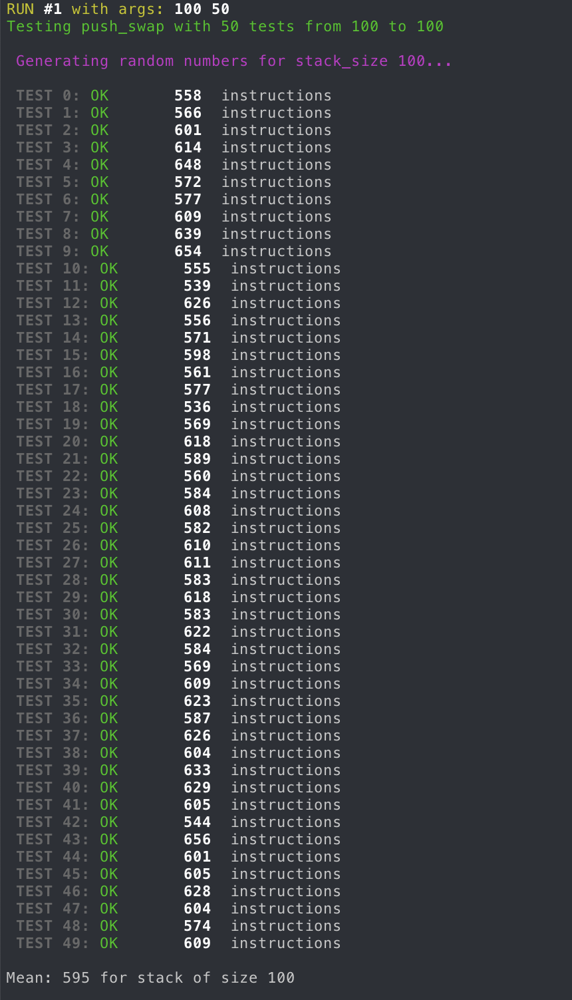
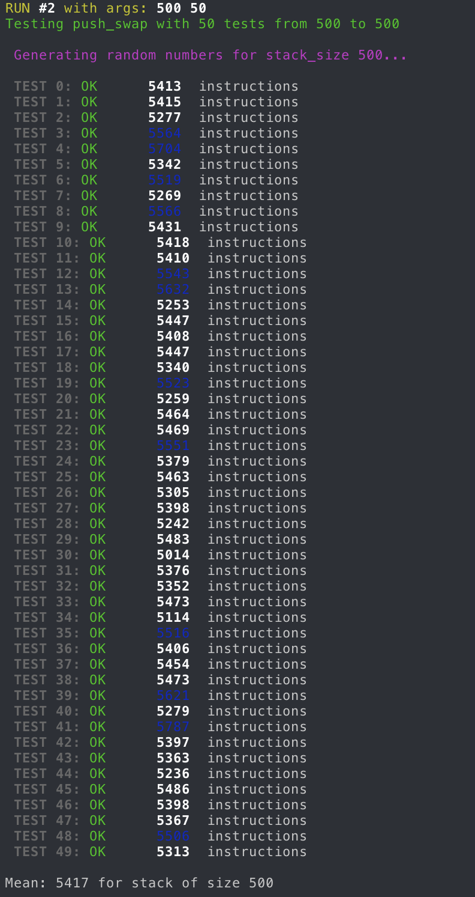

>Not the best, but it works

[ENGLISH VERSION](#english-version)

## Index
1. [Objectif](#objectif)
2. [Sujet](#sujet)
3. [Fonctionnement](#fonctionnement)
4. [Fonctions utilisées](#fonctions-utilisés)
	- [Parse](#parse)
	- [Erreurs](#errors)
	- [Checks](#checks)
	- [Moves](#moves)
	- [Algorithme](#algorithme)
5. [Résultats des tests](#résultats-des-tests)
6. [Notes](#note)
7. [Liens utiles](#liens-utiles)

<br>

## OBJECTIF
Développer un programme en langage C appelé "push_swap" qui prend la liste d'entiers comme argument en ligne de commande et affiche une séquence d'opérations permettant de trier ces entiers de manière optimale.

## SUJET
L'objectif principal du projet **push_swap** est de trier efficacement une pile d'entiers à l'aide d'un ensemble de règles prédéfinies, tout en minimisant le nombre d'opérations. <br>
L'idée centrale du projet est de créer deux piles, nommées "a" et "b", contenant une séquence d'entiers non triés au départ, tous empilés sur la pile "a". L'objectif est de trier ces entiers en utilisant un ensemble limité d'opérations de manipulation sur les piles.

#Contraintes et Règles
- Seules certaines opérations spécifiques sont autorisées pour manipuler les piles, telles que le déplacement d'éléments entre les piles, la rotation des éléments dans une pile, etc.
- L'efficacité du tri est mesurée en fonction du nombre total d'opérations effectuées.

<br>

## Fonctionnement

Le programme `push_swap` résout le problème de tri d'une pile d'entiers à l'aide d'opérations de manipulation de pile restreintes. Les opérations, telles que `sa`, `sb`, `ss`, `pa`, `pb`, `ra`, `rb`, `rr`, `rra`, `rrb`, `rrr`, permettent d'effectuer des swaps, des rotations et des opérations de poussée entre deux piles.

<br>

## Fonctions utilisés

### Parse
```
long ft_atol(const char *s);					// Convertit une chaîne de caractères en long.
void add_node(t_stack **stack, int n);			// Ajoute un nouveau nœud à la fin de la pile.
void stack_creator(t_stack **a, char **argv);	// Initialise la pile 'a' en analysant les arguments passés.
t_stack *get_cheapest(t_stack *stack);			// Identifie le nœud de coût minimum dans la pile.
void prep_for_push(t_stack **stack, t_stack *top_node, char stack_name); // Prépare la pile pour push.
```

### Errors
```
int error_syntax(char *str_n);				// Vérifie la syntaxe d'une chaîne de caractères.
int error_duplicate(t_stack *a, int n);		// Vérifie si un nombre particulier existe déjà dans la pile.
void free_stack(t_stack **stack);			// Libère la mémoire allouée pour une pile.
void free_errors(t_stack **a);				// Libère la mémoire allouée pour une pile en cas d'erreur.
```

### Checks
```
int stack_size(t_stack *stack);				// Retourne la taille de la pile.
bool stack_is_sorted(t_stack *stack);		// Vérifie si la pile est triée de manière croissante.
t_stack *find_last(t_stack *stack);			// Retourne le dernier nœud de la pile.
t_stack *find_min(t_stack *stack);			// Identifie le nœud contenant la valeur minimale dans la pile.
t_stack *find_max(t_stack *stack);			// Identifie le nœud contenant la valeur maximale dans la pile.
```

### Moves
```
void sa(t_stack **a, bool print);					// Swap sur la pile 'a'.
void sb(t_stack **b, bool print);					// Swap sur la pile 'b'.
void ss(t_stack **a, t_stack **b, bool print);		// Swap simultanée sur les piles 'a' et 'b'.
void ra(t_stack **a, bool print);					// Rotation vers le haut sur la pile 'a'.
void rb(t_stack **b, bool print);					// Rotation vers le haut sur la pile 'b'.
void rr(t_stack **a, t_stack **b, bool print);		// Rotation simultanée sur les piles 'a' et 'b'.
void rra(t_stack **a, bool print);					// Rotation inverse sur la pile 'a'.
void rrb(t_stack **b, bool print);					// Rotation inverse sur la pile 'b'.
void rrr(t_stack **a, t_stack **b, bool print);		// Rotation inverse simultanée sur les piles 'a' et 'b'.
void pa(t_stack **a, t_stack **b, bool print);		// Opération de poussée de 'b' vers 'a'.
void pb(t_stack **b, t_stack **a, bool print);		// Opération de poussée de 'a' vers 'b'.
```

### Algorithme
```
void sort_3(t_stack **a);
// Trie les trois premiers éléments de la pile 'a'.

void rotate_both(t_stack **a, t_stack **b, t_stack *cheapest_node);			
void rev_rotate_both(t_stack **a, t_stack **b, t_stack *cheapest_node);
// Rotation (inversée ou non) simultanée des piles 'a' et 'b' jusqu'à ce que le nœud le moins cher atteigne sa position cible.

void mover(t_stack **a, t_stack **b, bool side);
// Déplace les éléments nécessaires entre les piles 'a' et 'b' pour effectuer une opération de poussée ou de tirage.

void min_on_top(t_stack **a);
// Place le nœud minimum au sommet de la pile 'a'.

void sort_turk(t_stack **a, t_stack **b);
// Trie les piles 'a' et 'b' avec l'algo Turkey Sort (tri par insertion et des opérations de manipulation de pile.)
```

<br>
<br>

---

<br>

### Résultats des tests

<div style="display: flex; flex-wrap: wrap; justify-content: center;">
	
	
</div>

 
## Note


<br>

---

# ENGLISH VERSION 

## Index
1. [Objective](#objective)
2. [Topic](#topic)
3. [Operation](#operation)
4. [Used Functions](#used-functions)
    - [Parsing](#parsing)
    - [Errors](#errors)
    - [Checks](#checks)
    - [Moves](#moves)
    - [Algorithm](#algorithm)

<br>

## OBJECTIVE
Develop a C language program called "push_swap" that takes a list of integers as a command-line argument and displays a sequence of operations that optimally sorts these integers.

## TOPIC
The primary objective of the **push_swap** project is to efficiently sort a stack of integers using a set of predefined rules while minimizing the number of operations. <br>
The core idea of the project is to create two stacks, named "a" and "b", containing a sequence of unsorted integers initially, all stacked on "a". The goal is to sort these integers using a limited set of stack manipulation operations.

# Constraints and Rules
- Only specific operations are permitted for manipulating the stacks, such as moving elements between the stacks, rotating elements within a stack, etc.
- The efficiency of the sort is measured based on the total number of operations performed.

<br>

## Operation

The `push_swap` program solves the problem of sorting a stack of integers using restricted stack manipulation operations. Operations, such as `sa`, `sb`, `ss`, `pa`, `pb`, `ra`, `rb`, `rr`, `rra`, `rrb`, `rrr`, allow performing swaps, rotations, and push operations between two stacks.

<br>

## Used Functions

### Parsing
```
long ft_atol(const char *s);                    // Converts a string into long.
void add_node(t_stack **stack, int n);          // Adds a new node to the end of the stack.
void stack_creator(t_stack **a, char **argv);   // Initializes stack 'a' by parsing the passed arguments.
t_stack *get_cheapest(t_stack *stack);          // Identifies the minimum cost node in the stack.
void prep_for_push(t_stack **stack, t_stack *top_node, char stack_name); // Prepares the stack for push.
```

### Errors
```
int error_syntax(char *str_n);              // Checks the syntax of a string.
int error_duplicate(t_stack *a, int n);     // Checks if a particular number already exists in the stack.
void free_stack(t_stack **stack);           // Frees the memory allocated for a stack.
void free_errors(t_stack **a);              // Frees the memory allocated for a stack in case of an error.
```

### Checks
```
int stack_size(t_stack *stack);             // Returns the size of the stack.
bool stack_is_sorted(t_stack *stack);       // Checks if the stack is sorted in ascending order.
t_stack *find_last(t_stack *stack);         // Returns the last node of the stack.
t_stack *find_min(t_stack *stack);          // Identifies the node containing the minimum value in the stack.
t_stack *find_max(t_stack *stack);          // Identifies the node containing the maximum value in the stack.
```

### Moves
```
void sa(t_stack **a, bool print);                   // Swap on stack 'a'.
void sb(t_stack **b, bool print);                   // Swap on stack 'b'.
void ss(t_stack **a, t_stack **b, bool print);      // Simultaneous swap on stacks 'a' and 'b'.
void ra(t_stack **a, bool print);                   // Rotate upwards on stack 'a'.
void rb(t_stack **b, bool print);                   // Rotate upwards on stack 'b'.
void rr(t_stack **a, t_stack **b, bool print);      // Simultaneous rotation on stacks 'a' and 'b'.
void rra(t_stack **a, bool print);                  // Reverse rotation on stack 'a'.
void rrb(t_stack **b, bool print);                  // Reverse rotation on stack 'b'.
void rrr(t_stack **a, t_stack **b, bool print);     // Simultaneous reverse rotation on stacks 'a' and 'b'.
void pa(t_stack **a, t_stack **b, bool print);      // Push operation from 'b' to 'a'.
void pb(t_stack **b, t_stack **a, bool print);      // Push operation from 'a' to 'b'.
```

### Algorithm
```
void sort_3(t_stack **a);
// Sorts the top three elements of stack 'a'.

void rotate_both(t_stack **a, t_stack **b, t_stack *cheapest_node);
void rev_rotate_both(t_stack **a, t_stack **b, t_stack *cheapest_node);
// Simultaneous rotation (or reverse) of stacks 'a' and 'b' until the cheapest node reaches its target position.

void mover(t_stack **a, t_stack **b, bool side);
// Moves necessary elements between stacks 'a' and 'b' to perform a push or pull operation.

void min_on_top(t_stack **a);
// Places the minimum node at the top of stack 'a'.

void sort_turk(t_stack **a, t_stack **b);
// Sorts stacks 'a' and 'b' with the Turkey Sort algorithm (insertion sort and stack manipulation operations).
```

<br>

---

## Liens utiles

### Vidéo

- [push_swap : a performant sorting algorithm using 2 stacks](https://www.youtube.com/watch?v=OaG81sDEpVk&t=370s) by [Oceano](https://github.com/suspectedoceano)
- [push_swap TUTORIAL!](https://www.youtube.com/watch?v=wRvipSG4Mmk&pp=ygUJcHVzaF9zd2Fw) by [Thuggonaut](https://github.com/Thuggonaut)

### Article

- [Push Swap — A journey to find most efficient sorting algorithm](https://medium.com/@ayogun/push-swap-c1f5d2d41e97) by [A. Yigit Ogun](https://github.com/byaliego) (Pépite!)

### Tester

- [push_swap tester](https://github.com/louisabricot/push_swap_tester) by [Louisabricot](https://github.com/louisabricot/)


## Licence
This work is published under the terms of **[42 Unlicense](./LICENSE)**.
